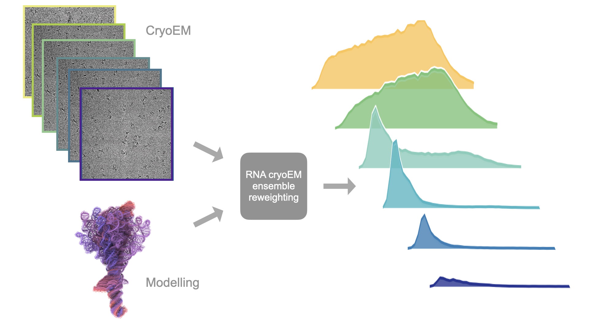

# RNA CryoEM Ensemble Reweighting

RNA molecules don't sit still — they explore many 3D shapes, and a single static
structure often can't explain their biological function. Single-particle cryoEM
offers a way to explore the ensemble distribution of an RNA from its individual
particle images.

This site walks through a pipeline that combines cryoEM particle images with a
prior ensemble to recover a **reweighted ensemble of RNA conformations**: not
just one structure, but a probability distribution over the shapes the molecule
actually adopts.

The pipeline has two inputs — cryo-EM particles and a modelled prior ensemble —
and four stages that turn them into a final conformational ensemble. Each stage
page below links out to the specific tool or in-house script used, so you can
go as deep as you like.

[Start with the Overview →](overview.md){ .md-button .md-button--primary }
