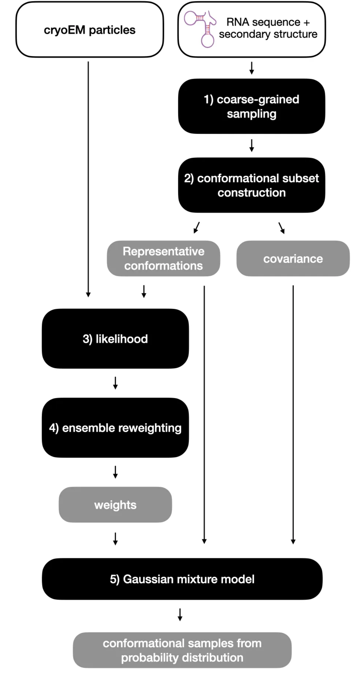

# Overview

If you don't write code and just want to understand *what this method does*,
start here.

CryoEM gives you thousands of noisy 2D images of individual RNA particles, each
a snapshot of the molecule in some conformation. On its own, that data doesn't
tell you which conformations are present or how common each one is. Separately,
you can use physics-based simulations to generate a large pool of *plausible*
RNA shapes, consistent with a known sequence and secondary structure. This
method's job is to connect the two: figure out which of those simulated shapes
best explain the experimental images, and in what proportions.

That's done in five stages:

1. **Coarse-grained sampling** — generate a large pool of candidate 3D
   conformations from the RNA sequence and secondary structure.
2. **Conformational subset construction** — cut that large pool down to a
   manageable, representative subset.
3. **Likelihood** — score how well each representative conformation explains
   the actual cryoEM particle images.
4. **Ensemble reweighting** — turn those scores into a set of weights: how much
   each conformation should count toward the final answer.
5. **Gaussian mixture model** — use the weighted, representative conformations
   (plus their covariance) to build a smooth probability distribution over
   RNA shape space, and draw a full conformational ensemble from it.

Each stage has its own page — see [Inputs](inputs.md) for what feeds the
pipeline, then walk through [Stage 1](stage1-sampling.md) onward, and
[Outputs](outputs.md) for what you get out the other end.
